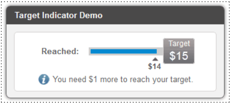

# Тестовое задание Target Indicator

Использовал Django и Vue.js

## Условие задания

Build static web page with following content:

## Запуск

Понадобится Python третьей версии.

Скачайте код с GitHub. Установите зависимости:

`pip3 install -r requirements.txt`

Запустите проект:

`python3 manage.py runserver`

Перейти по адресу [http://127.0.0.1:8000/](http://127.0.0.1:8000/) 

## Цели проекта

Тестовое задание.
